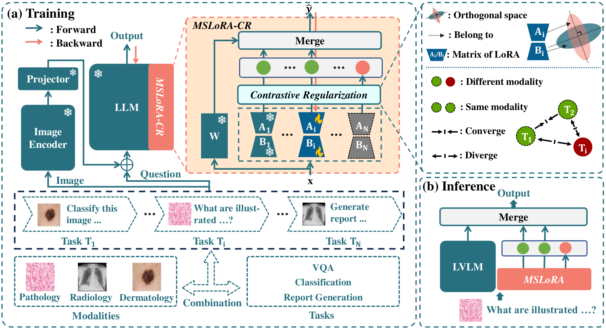

# Contrastive Regularization with LoRA for Multimodal Biomedical Image Incremental Learning

## 1. Release

- **📅 Last updated:** *July 5th, 2025*
- **📢 Paper:** Accepted at  [ACMMM2025](https://acmmm2025.org/)
- **📄 Paper Link:** [Contrastive Regularization with LoRA for Multimodal Biomedical Image Incremental Learning](https://arxiv.org/abs/2508.11673)
- **🔥 Initial Release:** We introduce **MSLoRA-CR**, a novel framework that integrates **modality-specific LoRA** and **contrastive regularization** to tackle **multimodal biomedical image incremental learning** in large vision-language models (VLMs).
   This framework enables **scalable and efficient continual learning** across diverse medical imaging modalities.

<p align="center">
  
</p>

------

## 2. Installation

### Step 1: Clone the Repository

```bash
git clone https://github.com/VentusAislant/MSLoRA_CR.git
cd MSLoRA_CR
```

### Step 2: Set Up Python Environment

We recommend using `conda` for environment isolation.

```bash
conda create -n mslora_cr python=3.10 -y
conda activate mslora_cr
```

Install the core package:

```bash
pip install -e .
```

Install optional dependencies for training and evaluation:

```bash
pip install -e .[train]
pip install -e .[eval]
```

### Step 3: Link Datasets and Pre-trained Models

Set the following environment variables to your actual paths:

```bash
export LLAVA_MED_V1_5="path/to/llava_med_v1.5"
export MSLORA_DATA="path/to/data/MSLoRA_CR"
export CLIP_PATH="path/to/models/openai"
```

Create required directories and symbolic links:

```bash
mkdir -p data pretrained_models checkpoints

ln -s ${MSLORA_DATA} ./data/MSLoRA_CR
ln -s ${LLAVA_MED_V1_5} ./pretrained_models/llava_med_v1.5
ln -s ${CLIP_PATH} ./pretrained_models/openai
```

> 💡 **Note**: Ensure the target paths exist before creating symlinks. If re-running this script, you may need to remove or overwrite existing links.

## 3. Prepare

### 3.1 Prepare Datasets

#### Overview

The dataset directory structure should be organized as follows:

```plain text
DATA_ROOT/
├── CXP/
│   ├── train/
│   ├── test/
│   ├── test.jsonl
│   └── train.json
├── Fitzpatrick/
│   ├── images/
│   ├── test.jsonl
│   └── train.json
├── HAM/
│   ├── images/
│   ├── test.jsonl
│   └── train.json   
├── IU-X-Ray/
│   ├── NLMCXR_png/
│   ├── test.jsonl
│   └── train.json  
├── PathVQA/
│   ├── images/
│   ├── test.jsonl
│   └── train.json  
├── PCam/
│   ├── train/
│   ├── test/
│   ├── test.jsonl
│   └── train.json
├── Slake-VQARad/
│   ├── Slake_images/
│   ├── VqaRad_images/
│   ├── test.jsonl
│   └── train.json  
└── WSI-DX/
    ├── images/
    ├── test.jsonl
    └── train.json  
```

#### Image Downloads

Please manually download the image files from the following sources:

- **CXP**
   Download the `train/` and `test/` image folders from [Kaggle - Chest X-Ray Pneumonia](https://www.kaggle.com/datasets/paultimothymooney/chest-xray-pneumonia)

- **Fitzpatrick**
   Due to licensing restrictions, access must be requested from the authors via [Fitzpatrick17k GitHub](https://github.com/mattgroh/fitzpatrick17k)

- **HAM**
   Download the `images/` folder from [HAM10000 on Harvard Dataverse](https://dataverse.harvard.edu/dataset.xhtml?persistentId=doi:10.7910/DVN/DBW86T)

- **IU-X-Ray**
   Download the `NLMCXR_png/` folder according to [BioCaption Github](https://github.com/nlpaueb/bioCaption/)

- **PathVQA**
   Download the `images/` folder from [PathVQA](https://drive.google.com/file/d/1utnisF_HJ8Yk9Qe9dBe9mxuruuGe7DgW/view?usp=sharing)

- **Slake-VQARad**

  - Download `Slake_images/` from [SLAKE](https://www.med-vqa.com/slake/)
  - Download `VqaRad_images/` from [VQARAD (OSF)](https://osf.io/89kps/)

- **WSI-DX**
   Download the `images/` folder from [NMI-WSI Diagnosis Project](https://figshare.com/projects/nmi-wsi-diagnosis/61973)

  > *Note: We only use files under `Slide/Thumbnails/*.png`*

#### Annotation Files

The `train.json` and `test.jsonl` files for each dataset can be downloaded from: [MSLoRA_CR_dataset](https://huggingface.co/datasets/VentusAislant/MSLoRA_CR)

------

### 3.2 Prepare Pre-trained Models

#### Overview

The model directory structure should be:

```plain text
PRETRAINED_MODELS_ROOT/
├── llava_med_v1.5/
└── openai/
    └── clip-vit-large-patch14-336/
```

#### llava_med_v1.5

Download from [Hugging Face - microsoft/llava-med-v1.5-mistral-7b](https://huggingface.co/microsoft/llava-med-v1.5-mistral-7b)

> **Note:** If you plan to use a local copy of `openai/clip-vit-large-patch14-336` as the vision encoder, please manually update the `"mm_vision_tower"` field in `llava_med_v1.5/config.json` to:
>  `./pretrained_models/openai/clip-vit-large-patch14-336`

#### CLIP Vision Encoder

Download `openai/clip-vit-large-patch14-336/` from [Hugging Face - OpenAI](https://huggingface.co/openai/clip-vit-large-patch14-336)

## 4. Download Our Checkpoints

You can download our checkpoints for **inference only** from Hugging Face:

| Model Name                                                 | Download Link                                                |
| ---------------------------------------------------------- | ------------------------------------------------------------ |
| `finetune_lora_each-64-64_llava_med_v1.5`                  | [🤗 Data-Specific Finetune](https://huggingface.co/VentusAislant/MSLoRA_CR/tree/main/finetune_lora_each-64-64_llava_med_v1.5) |
| `finetune_lora_MSLoRA-CR-ORTHO-64-64_llava_med_v1.5`       | [🤗 MSLoRA-CR-ORTHO](https://huggingface.co/VentusAislant/MSLoRA_CR/tree/main/finetune_lora_MSLoRA-CR-ORTHO-64-64_llava_med_v1.5) |
| `finetune_lora_MSLoRA-CR-ORTHO_6TASK-64-64_llava_med_v1.5` | [🤗 MSLoRA-CR-ORTHO-6TASK](https://huggingface.co/VentusAislant/MSLoRA_CR/tree/main/finetune_lora_MSLoRA-CR-ORTHO_6TASK-64-64_llava_med_v1.5) |

## 5. Training and Evaluation

### 🏋️‍♀️ Training

```bash
# Train LoRA adapters separately for each task
bash scripts/finetune_lora_each.sh

# Train MSLoRA-CR-ORTHO on all 8 tasks
bash scripts/finetune_mslora_cr_ortho.sh

# Train MSLoRA-CR-ORTHO on 6 tasks
bash scripts/finetune_mslora_cr_ortho_6task.sh
```

### 📈 Evaluation

```bash
# Evaluate individually trained LoRA adapters
bash scripts/eval_lora_each.sh

# Evaluate MSLoRA-CR-ORTHO on 8 tasks
bash scripts/eval_mslora_cr_ortho.sh

# Evaluate MSLoRA-CR-ORTHO on 6 tasks
bash scripts/eval_mslora_cr_ortho_6task.sh
```

## 6. Citation

If you find **MSLoRA-CR** useful for your research or applications, please cite our work using the following BibTeX entry:

- **arXiv version**

  ```bibtex
  @article{zhang2025mslora,
    title   = {Contrastive Regularization over LoRA for Multimodal Biomedical Image Incremental Learning},
    author  = {Zhang, Haojie and Liang, Yixiong and Kuang, Hulin and Cen, Lihui and Qu, Zhe and Cen, Yigang and Zeng, Min and Kan, Shichao},
    journal = {arXiv preprint arXiv:2508.11673},
    year    = {2025},
    url     = {https://arxiv.org/abs/2508.11673}
  }

- Final ACM Multimedia version

  ```bibtex
  @inproceedings{zhang2025mslora,
    title = {Contrastive Regularization over Lo{RA} for Multimodal Biomedical Image Incremental Learning},
    author = {Haojie Zhang and Yixiong Liang and Hulin Kuang and Lihui Cen and Zhe Qu and Yigang Cen and Min Zeng and Shichao Kan},
    booktitle = {Proceedings of the 33rd ACM International Conference on Multimedia (MM '25), October 27--31, 2025, Dublin, Ireland},
    year = {2025},
    doi = {10.1145/3746027.3754917},
    url = {https://dl.acm.org/doi/10.1145/3746027.3754917}
  }
  ```

------

## 7. Acknowledgements

We gratefully acknowledge the following project as the foundation of our codebase:

- [**LLaVA-Med**: *Training a Large Language-and-Vision Assistant for Biomedicine in One Day*](https://github.com/microsoft/LLaVA-Med)
- [**LoRA**: *Low-Rank Adaptation of Large Language Models*](https://github.com/microsoft/LoRA)
